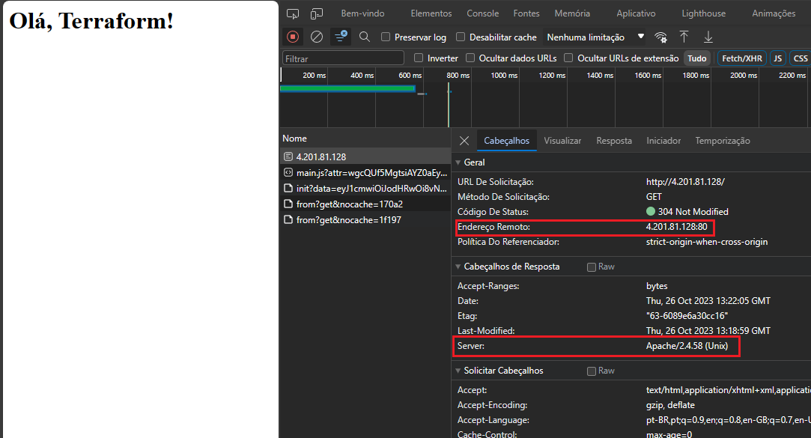

<h1>Deploy to Azure Provider with Terraform</h1>

<h3 align="justify">Neste repositório você encontra um exemplo de deploy de um container apache no provider Azure utilizando o Terraform.</h3>

<h4 align="justify">Aspectos Principais:</h4>

- 
Criação dos parâmetros resource group, virtual network, subnet, public ip, security group, network interface e virtual machine;

- 
Instância Standard_B1ls com Ubuntu Server 20.04-LTS;

- 
Instalação do Docker e Docker-Compose;

- 
Acesso ao servidor por chaves assimétricas;

- 
Provisioner local-exec para a criação do arquivo index.html;

- 
Provisioner file para o envio dos arquivos pkgs.sh, docker-compose.yml e index.html para a instância;

- 
Provisioner remote-exec para a execução do script pkgs.sh, docker-compose, permissão do diretório "storage_app" e atualização do servidor apache;

    

